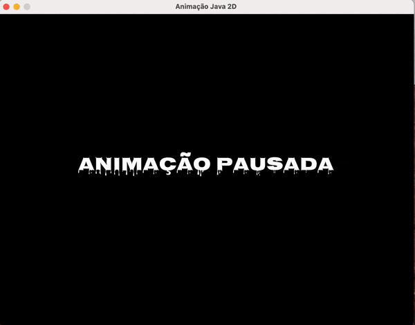

 [](LICENSE)

# Animação com Java 2D com a API Swing

> ## Aviso de isenção de responsabilidade
> 
>Esse projeto foi propositalmente mal organizado. Tem como único objetivo servir de esqueleto para que possa ser melhorado e usado em projetos desenvolvidos pelos estudantes na disciplina de Programação Orientada a Objetos.

Um exemplo simples de como fazer animações 2D usando Java com a [API Swing](https://docs.oracle.com/javase/tutorial/uiswing). O código aqui disponibilizado pode ser evoluído para construir jogos simples em Java.


No exemplo é demonstrado como:

- Carregar imagem do disco
- Carregar sons do disco
- Carregar fontes do disco
- Desenhar imagem
- Uso de uma matriz de inteiros para desenhar cenários
- Tratar colisão do objeto com as bordas da janela
- Tratar colisão entre objetos na tela (por meio  intersecção entre dois retângulos)
- Capturar teclas pressionadas pelo usuário
  - barra de espaço pausa o jogo
  - seta para direita ou para esquerda para movimentar um objeto na tela
  - tecla 's' ativa ou desativa o som
  - tecla 'q' para sair


Toda a lógica foi deixada dentro da classe [App.java](app/src/main/java/poo/App.java) com o objetivo de facilitar a leitura e entendimento. Contudo, caso queira fazer um jogo a partir desse código, entenda que precisará seguir o que manda o paradigma da Programação Orientada a Objetos e o princípio de separação de responsabilidades.


## Para executar o projeto

O projeto foi criado com o [gradle 8.4](https://gradle.org) e funciona com o JDK 8 ou superior.

Pode abrir o projeto em qualquer IDE que tenha suporte ao gradle e executar por lá ou executar pelo terminal com o comando:

```bash
# no Linux ou macOS
./gradlew run

# no Windows
gradlew.bat run
```



## Empacotando a aplicação em um arquivo JAR

Caso queira empacotar a aplicação compilada dentro de um arquivo `.jar`, execute:
```bash
./gradlew jar
```
Será gerado arquivo `app.jar` dentro do diretório `app/build/libs/`.

Para executar a aplicação empacotada no `.jar` execute:
```bash
java -jar app.jar
```

## Outras formas para distribuir a aplicação

### Empacotar aplicação em um ZIP com a tarefa distZip

```bash
./gradlew distZip
```
A aplicação compilada, juntamente com *scripts* para sua execução estará dentro de um ZIP no diretório: `app/build/distributions`

Basta descompactar o arquivo `app.zip` e executar o *script*:

```bash
# Linux ou macOS
app/bin/app

# Windows
app/bin/app.bat
```
### Empacotar aplicação com a ferramenta `jpackage` do JDK


O JDK vem com uma ferramenta chamada [`jpackage`](https://docs.oracle.com/en/java/javase/21/jpackage) que permite empacotar aplicações Java para facilitar sua distribuição e instalação em outros computadores. A ferramenta gera instaladores para os sistemas operacionais Linux, macOS e Windows. 

Na [documentação oficial](https://docs.oracle.com/en/java/javase/21/jpackage/packaging-overview.html#GUID-E0966C49-ABBB-46A2-8DF7-1D3F96640F05) são apresentados os passos para preparar uma aplicação, além de personalizações como definição de ícone da aplicação, etc. 

Com o `jpackage` a aplicação é empacotada juntamente com ambiente de execução Java (JRE, *Java Runtime Environment*), permitindo assim que possa ser executada em computadores que não tenham um JRE instalado.

Abaixo são apresentados os passos para criar uma aplicação Java com o gradle e depois como empacota-la usando `jpackage` no sistema operacional Ubuntu Linux. Como resultado será gerado um arquivo `.deb` contendo a aplicação. 

```bash
./gradlew installDist

cd app/build/libs

jpackage --name Jogo --input . --main-jar app.jar --main-class poo.App
```

Se executar os comandos acima no Windows, então o jpackage irá gerar um instalador para Windows. Se executar em um macOS, gerará instalador para esse sistema operacional. 

## Referências

- [Fonte Nosifer](https://fonts.google.com/specimen/Nosifer)
- [Fonte Seven Segment](https://www.dafont.com/seven-segment.font)